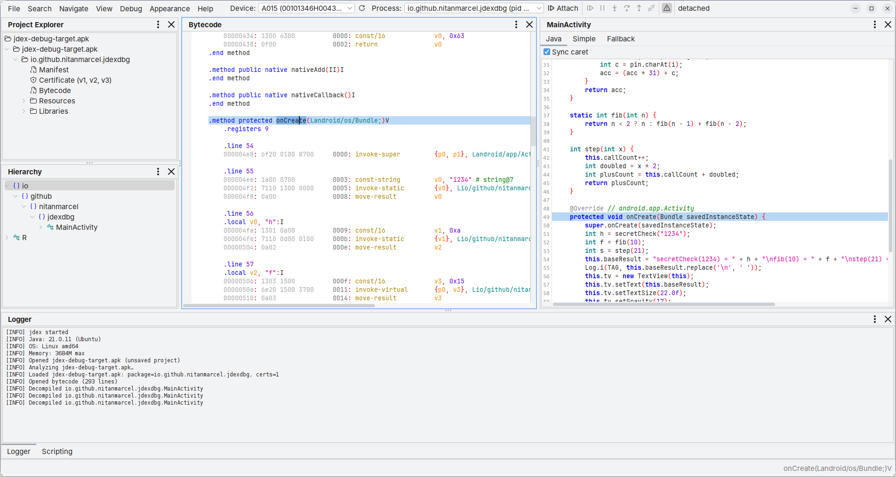
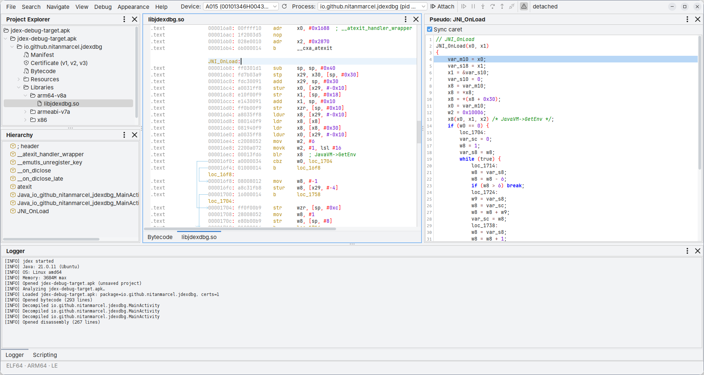

# jdex
Apk disassembler and decompiler based on [jadx](https://github.com/skylot/jadx)




# Building
* Requires Java 21
* Requires CMake

```sh
git submodule update --init
./gradlew shadowJar
```
```sh
java -jar app/build/libs/jdex.jar
```

# WIP 

Project is in early stages, some features are either missing on partially implemented.
